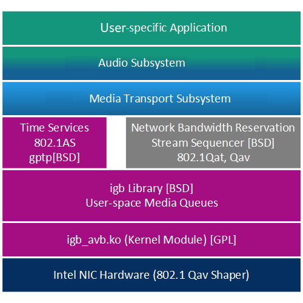

# AVB Stream Handler

#################################################################################
@section overview Overview
#################################################################################

The _Media Transport Subsystem_ provides mechanisms to stream media content through the in-vehicle network.
In the current version, media content is limited to PCM audio, H.264 and MPEG-TS video.
The only available in-vehicle network is Ethernet* AVB.

The principal component of the Subsystem is the AVB Stream Handler which acts as link between the AVB-capable Ethernet* interface and audio/video applications local to the device.
Audio applications can receive and transmit audio data through ALSA interfaces.
Video applications can receive and transmit either H.264 encoded video or MPEG-TS streams.
The Stream Handler ensures proper AVB packet generation following the IEEE1722 standard and observes the subset of IEEE802.1Q deemed relevant for automotive applications.
The Stream Handler relies on an implementation of the IEEE802.1AS standard (gPTP) to establish a network-wide reference time base.

@note Please note that this document describes the Reference System only.
User specific manifestations may vary in their available components and features. For user systems please refer to the documentation accompanying the user delivery.

###############################################################
@subsection arch_overview Architectural Overview

The figure above shows the position of the Media Transport layer within the \IASPrgName Software.

The Media Transport Subsystem can be controlled by the class interface or using a configuration plug-in (see section @ref configuration).

###############################################################
@subsection features Features

The AVB Stream Handler provides the following features:

* AVB multi stream audio and video transmission using IEEE1722 protocol
* ALSA audio interfaces
* Video streaming interfaces
* CommonAPI control interface with D-Bus binding (SOME/IP to follow)
* Configuration interface enabling the user to provide its own configuration library
* Supported audio sample rates: 48 kHz and 24kHz
* AVB audio format: _eIasAvbAudioFormatSaf16_ (AVTP 16 bit)
* Audio format for ALSA interfaces: _eIasAvbAudioFormatSaf16_
* Video formats: MPEG-TS, H.264

#### Restrictions
* The only assign mode supported is _eIasAvbIdAssignModeStatic_.
* The ALSA interface does not completely emulate sound card hardware; some applications might not be able to use the ALSA interface.

###############################################################
@subsection basic_concept Basic Concept

The Stream Handler creates transmit and receive *network streams* to transfer IEEE1722 data over the network (comparable to a network socket) and *local streams* representing a group of audio channels function as interconnection to local audio interfaces.

<!-- todo describe Alsa interface more -->
Network streams are represented by an AVB stream ID whereas local stream are represented by a local stream ID. Each local stream
creates an Alsa device. Regular ALSA applications like arecord and aplay or alsaloop can be used to push and pull samples in and out of that streams.
All channels belonging to the same local stream are connected in one block. To stream data the local and network streams need to be
connected. If the network transmit stream has less channels than the local stream, an error is returned.
If the network transmit stream has more channels than the local stream, the higher channels will be filled with zeroes.
For network receive streams the same logic applies, the network stream must not have fewer channels than the local stream, and if it has more channels those will be filled with zeroes.

The following steps need to be done in order to get an audio stream out of AVB:

1. create a transmit network stream.
2. create a local stream.
3. connect the network stream to the local stream.
4. activate the network stream.

Note: A network stream can be activated directly upon creation; as long as it is not connected to anything,
 it will generate a "NULL stream" (i.e. a stream not containing any actual audio data).
Such a stream could be useful to convey media clock information in order to synchronize local media processing to a remote clock. 
The preferred way to do ot although is to use a clock reference stream.

The API used to perform those steps listed above is available in as a C++ class interface.
The C++ interface is also used by the configuration plug-in, a shared library dynamically linked to the Stream Handler.
The streams created and connected by this configuration plug-in can be used before the regular control paths become active at system boot time, and hence provide early audio functionality.
In theory, all network streams and local streams used in a system can be pre-defined in the configuration plug-in.

@note There is a maximum number of channels for any audio stream. It's related to the size of an Ethernet data packet which is 1500 bytes.
It is calculates by:

(Ethernet data length (1500) - AAF header (24)) / size of AAF 16-bit data type (2) = 738

This absolute maximum number of channels is set to 738 mono channels of type AAF 16-Bit (aka SAF16). 
Please note that the actual maximum number is dependent on data type, SR class and sample frequency (in the current implementation).

###############################################################
@subsection config Configuration Library

The configuration library is a shared object that is used by the AVB Stream Handler to preconfigure AVB network and local streams during start-up phase.
It provides definitions for _targets_ which comprises target related definitions like network interface name and further registry entries.
In addition so called _profiles_ are specified defining all variants of streams (including test streams) and registry entries as well.

@note Since the configuration library is project specific, this documentation describes only the reference configuration, see section @ref configuration.
For user specific implementations please refer to the delivery documentation for avb_customer_config.

#################################################################################
@section cd_mcr Clock Domains, Media Clock Recovery (MCR)
#################################################################################

###############################################################
@subsection clock_domains Clock Domains

The Stream Handler is able to operate on multiple media clocks simultaneously. Each AVB stream can be associated with a separate media clock; however,
on a typical system, there will be only a very limited amount of those. The Stream Handler supports the following predefined clock domains:

* _cIasAvbPtpClockDomainId_  
  A "default" media clock that can be used when no local clock is present (e.g. playback of a .wav file). By definition,
  it is synchronized to the 802.1AS "wall clock" (i.e. having a rate ratio of 1.0).
* _cIasAvbHwCaptureClockDomainId_  
  __deprecated__ in MRB, only available in Bloomfield Hills hardware.
  A media clock measured by the HW time capturing feature of the Springville chip.
  The nominal frequency of the measured clock has to be specified using the _cClockHwCapFrequency_ registry key.
  Note that only low frequencies up to ~200Hz can be measured this way.

If hardware support is available (which is NOT the case for MRB) it is recommended to use the HW capture clock domain. In this case the hardware has to provide a signal at a low frequency that is locked to the actual media clock frequency. Typically a clock divider (e.g., 48kHz/256 = 187.5Hz) needs to be integrated.

In any other cases the PTP clock domain shall be used.

Furthermore, it is possible to define more clock domains by referencing incoming AVB streams.
The Stream Handler is capable of analyzing the media clock rate of incoming AVB streams, based on the time stamp sequence embedded in the stream and the average packet rate.
This information can be compared against the rate of a local clock domain.
The result of this comparison can be used to control a local adjustable oscillator (e.g. a PLL) in order to recreate the media clock as a physical signal with the quality required to drive audio HW, for instance a D/A converter.

Since the details of how to control such an oscillator are hardware- and project-specific, the Stream Handler cannot provide the code itself.
\IASPrgName Software includes a clock driver library controlling the PLL chip that is used in a previous reference system (Only useful for Bloomfield Hills).

The Stream Handler will load a clock driver library when the library's file name is specified using IasAvbConfigRegistryInterface::setConfigValue()
with the cClockDriverFileName registry key from within the configuration plug-in. Note that, for security reasons, no path must be specified;
the Stream Handler will use its library search path to find the library.

Please see also the reference documentation of

  media_transport\/avb\_streamhandler\/IasAvbClockDriverInterface.hpp
  media_transport\/avb\_streamhandler\/IasAvbRegistryKeys.hpp

for further information.

Instead of using the incoming media clock rate from another AVB talker as control the hardware PLL on board,
this clock can also define additional clock domains that have their audio processed with other clock domains after sample rate conversion.

###############################################################
@subsection mcr Media_Clock_Recovery

<!-- todo filled with text ... -->

#################################################################################
@section sr_classes Stream Reservation Classes (SR Classes)
#################################################################################

Any AVB device can support two stream reservation classes at the same time, that could be A and B or A and C or one type of C and another type of C.
We call them SRC high and low, and the configuration sets the desired class, and in case of class C, also the desired interval.
For an optimum of latency and cpu interrupt load, usually class "high" is used for AVB audio streams and class "low" used for AVB video streams.

The class 'high' relates to:

    * The higher VLAN priority value (typically 3, as only 2 and 3 should be used for AVB)
    * The shorter measurement interval
    * The shorter presentation time offset

Attributes that can be adjusted per SR class are listed in the following table.
The word **high** or **low** has to be added to each key name to select the class for which the parameter should be added.
The keys are defined in the public header file **IasRegistryKeys.hpp**.
The default values for high correspond to class A and those for low to class B as defined in IEEE801Q and amendments by the AVnu Automotive Functional Specification.

|Key                            |Description                    |Default(**high**)|Default(**low**)|
|-------------------------------|-------------------------------|-----------------|------------|
|tspec.interval                 |Class Measurement Interval     |125000ns         |250000ns    |
|tspec.vlanid                   |VLAN ID                        |2                |3           |
|tspec.vlanprio                 |VLAN priority (PCP)            |3                |2           |
|tspec.presentation.time.offset |Maximum Transit Time           |1875000ns        |9750000ns   |
|tx.maxbandwidth                |Maximum Bandwidth              |70000kbit/s      |70000kbit/s |

It is common practice to adjust these parameters to the parameters of the SR class that is needed in a project through registry entries in the configuration plugin for the project.
For instance, changing **tspec.interval.low** to 1333000 and **tspec.presentation.time.offset** to `15000000-125000=14875000`
would turn the low class into **class C** (64 samples at 48kHz per package) as defined by the AVnu automotive profile.

The values can also be changed from the command line using the -k option (Note: -k option is not available in production mode), but you need to ensure that those options are written behind the -p for a specific profile, since the profile might set those values and would override your -k settings if -p appears later in the command line.

Naturally, for each stream to be created, you must choose which of the two defined SR classes should apply.

###############################################################
@subsection minterval Measurement Interval

The measurement interval (also referred as observation interval) depends on SR class:

    - class A: 125us (8000 intervals per second)
    - class B: 250us (4000 intervals per second)
    - class C: 1.33ms (750 intervals per second) - or any other value, since that has to be configured according to @class_c.

You can replace the word _intervals_ with _packages_ in the case of only sending one package per measurement interval. 
For higher bandwidth needs it's possible to send __n__ multiple packages during a measurement interval.

It is recommended to take this interval into account when specifying the parameter for video streams in order to achieve a better average load.
For the example above a stream of class C has 750 measurement intervals per second.
When specifying a maximum of 3000 packets per second, than you'll get:

    3000 packets/sec / 750 intervals/sec = 4 packets/interval

###############################################################
@subsection class_c Using Stream Reservation Class C

You may need to use a stream reservation class other than A and B. This new class is always called class C (user specific).
The traffic streaming and the measurement interval must always be defined according to the amount of traffic that is needed.

To enable Class C according to the AutoCDSFunctionalSpec from AVnu, the measurement interval needs to be set to **1333µs for 48 kHz and 64 samples per packet**
in both communication partners. See section @configuration how to configure the AVB Stream Handler application.

###############################################################
@subsection tx_ring_size TX Descriptor Ring Size

To send data to network the I210 uses a so called TX descriptor ring. The default value of this ring is 256 entries. Depending on the number of 
concurrent AVB transmit streams this value might be too small. Based on the stream reservation class (SRC) that is used, the transmit window
(the interval AVB packets are prepared for) which is 3ms and a safety margin of 30% the number of maximum concurrent transmit streams can be 
looked up from the tables below. 

The number of required TX descriptor entries can be calculated by the following equation:

    Number of TX descriptors = Packets per second * TX window * number of streams * two entries (each stream needs two entries in the ring) + 30% safety margin
    Example: 8000 * 0.003 * 10 * 2 * 1.3 = 624 => 1024 

####Class A 
Packets per Second: 8000 
TX Window: 3ms 
Safety Margin: 30% 

|TX Descriptor Size  |Max Number Streams|
|--------------------|------------------|
|4096                |65                |
|2048                |32                |
|1024                |16                |
| 512                |8                 |
| 256                |4                 |
| 128                |2                 |
|  64                |1                 |

####Class B 
Packets per Second: 4000 
TX Window: 3ms 
Safety Margin: 30% 

|TX Descriptor Size  |Max Number Streams|
|--------------------|------------------|
|4096                |131               |
|2048                |65                |
|1024                |32                |
| 512                |16                |
| 256                |8                 |
| 128                |4                 |
|  64                |2                 |

####Class C 
Packets per Second: 750 
TX Window: 3ms 
Safety Margin: 30% 

|TX Descriptor Size  |Max Number Streams|
|--------------------|------------------|
|4096                |700               |
|2048                |350               |
|1024                |175               |
| 512                |87                |
| 256                |43                |
| 128                |21                |
|  64                |10                |

If a change of the descriptor ring size is required it can be done in different ways:
* AVB streamhandler command line parameter (not recommended)
* using Ethtool before starting AVB streamhandler
* Command line parameter of igb_avb driver (recommended): 
    sudo insmod igb_avb.ko tx_size=\<value\> 

###############################################################
@subsection other_config Other Configuration Options

### Presentation time offset and audio buffer size

The Stream Handler deals with the presentation time in different ways based on the configuration value of the 'audio.tstamp.buffer' key. You may choose one of the modes below.

    -k audio.tstamp.buffer=mode (0=off, 1=fail-safe, 2=hard)

off: The received audio samples will be passed to ALSA at the period cycle regardless of the presentation time.

fail-safe: The received audio samples will be passed to ALSA in accordance with the presentation time. When the Stream Handler cannot guarantee the presentation time due to some reasons, for example due to buffer shortage, it will switch the mode to 'off' for fail-safe purpose.

hard: It keeps passing audio samples to ALSA in accordance with the presentation time. It never changes the mode even in case of failure. If the size of the buffer containing data samples is incorrect, or requested presentation time is too far-away audio sample dropping will happen. It is important to set appropriate presentation time offset and audio buffer size to avoid such a problem.

The 'fail-safe' and the 'hard' mode will achieve better deterministic behavior based on the presentation time for the audio playback. However it requires appropriate adjustments for multiple attributes in particular the presentation time offset and the audio buffer size. Relevant attributes are listed in the following table.

|Key                             |Alias                     |Description                                                |
|--------------------------------|--------------------------|-----------------------------------------------------------|
|local.alsa.baseperiod           | cAlsaBasePeriod          | Base frequency for ALSA engine                            |
|local.alsa.basefreq             | cAlsaBaseFreq            | Base ALSA period size for ALSA engine                     |
|local.alsa.ringbuffer           | cAlsaRingBufferSz        | Local audio buffer size                                   |
|audio.basefill.multiplier       | cAudioBaseFillMultiplier | Factor to specify the fill level of the local audio buffer, which ALSA starts reading samples at. The default value is 15 which will be the factor 1.5. ALSA will start reading samples from local audio buffer when its fill level reached at 1.5 times of cAlsaBasePeriod.|
|tspec.presentation.time.offset  | cTSpecPresTimeOff        | Maximum Transit Time (ns)                                 |
|tspec.interval                  | cTSpecInterval           | Class Measurement Interval (ns)                           |
|< none >                        | cRxCycleWait             | Cycle RX worker thread runs at (ns)                       |
|< none >                        | cXmitWndWidth            | Window size TX worker thread deals with in one cycle (ns) |
|< none >                        | cXmitWndPitch            | Cycle TX worker thread runs at (ns)                       |

 

|ALSA Local Stream Parameter |Description (see IasAvbControl::createAlsaStream)  |
|----------------------------|---------------------------------------------------|
|alsaStreamPeriodSize        | Period size of ALSA local stream                  |
|alsaStreamSampleFreq        | Sample frequency of ALSA local stream (Hz)        |

You need to adjust the above keys as well as the ALSA local stream parameters to satisfy the formulas below.

    cAlsaRingBufferSz >= (ceiling(max(minRxBufferSz, minTxBufferSize) / minPeriodSz)) * minPeriodSz

    minRxBufferSz = (cTSpecPresTimeOff + cRxCycleWait) * sampleFreq / 1e9 + (cAudioBaseFillMultiplier / 10) * minPeriodSz
    minTxBufferSz = (ceiling(cXmitWndWidth * packetPerSecond / 1e9) + 1 + floor(periodTime / cXmitWndPitch)) * samplesPerChannelPerPacket

    minPeriodSz = alsaStreamPeriodSize (or cAlsaBasePeriod if alsaStreamPeriodSize * cAlsaBaseFreq mod(cAlsaBasePeriod * alsaStreamSampleFreq) = 0)
    sampleFreq  = alsaStreamSampleFreq (or cAlsaBaseFreq if alsaStreamPeriodSize * cAlsaBaseFreq mod(cAlsaBasePeriod * alsaStreamSampleFreq) = 0)
    packetPerSecond = 1e9 / cTSpecInterval
    periodTime = minPeriodSz / sampleFreq * 1e9
    samplesPerChannelPerPacket = sampleFreq / packetPerSecond

For example MRB_Master_AVB and MRB_Slave_AVB profiles have the following configurations.

    Common Settings:
    cAudioBaseFillMultiplier = 15
    cTSpecPresTimeOff = 2000000
    cRxCycleWait = 2000000
    cXmitWndWidth = 3000000
    cXmitWndPitch = 2000000
    cTSpecInterval = 1333333
    sampleFreq = 48000
    packetPerSecond = 1e9 / cTSpecInterval = 1e9 / 1333333 = 750
    periodTime = minPeriodSz / sampleFreq * 1e9 = 192 / 48000 * 1e9 = 4000000
    samplesPerChannelPerPacket = sampleFreq / packetPerSecond = 48000 / 750 = 64

    Example 1:
    alsaStreamPeriodSize = 192
    cAlsaBasePeriod = 128
    minPeriodSz = 192 (because alsaStreamPeriodSize * cAlsaBaseFreq mod(cAlsaBasePeriod * alsaStreamSampleFreq) != 0)
    sampleFreq = 48000

    minRxBufferSz = (cTSpecPresTimeOff + cRxCycleWait) / 1e9 * sampleFreq + 2 * (cAudioBaseFillMultiplier / 10) * minPeriodSz
                  = (2000000 + 2000000) / 1e9 * 48000  + 2 * (15 / 10) * 192
                  = 192 + 576
                  = 768

    minTxBufferSz = (ceiling(cXmitWndWidth * packetPerSecond / 1e9) + 1 + floor(periodTime / cXmitWndPitch)) * samplesPerChannelPerPacket
                  = (ceiling(3000000 * 750 / 1e9) + 1 + floor(4000000 / 2000000)) * 64
                  = (3 + 1 + 2) * 64
                  = 384

    cAlsaRingBufferSz = ceiling(max(minRxBufferSz, minTxBufferSz) / minPeriodSz)*minPeriodSz
                      = ceiling(max(768, 384)/192)*192
                      = 768

    RxBufLatency = cAudioBaseFillMultiplier / 10 * periodTime = 6000000 = 6 ms
    TxBufLatency = max(minTxBufferSz, ceiling(cAudioBaseFillMultiplier / 10) * minPeriodSz) / sampleFreq * 1e9 = 2 * 192 / 48000 + 1e9 = 8000000 = 8 ms

    ---
    Example2:
    alsaStreamPeriodSize = 2048
    cAlsaBasePeriod = 256
    minPeriodSz = 256 (because alsaStreamPeriodSize * cAlsaBaseFreq mod(cAlsaBasePeriod * alsaStreamSampleFreq) = 0)
    sampleFreq = 48000
    periodTime = 5333333 ms

    minRxBufferSz = (2000000 + 2000000) / 1e9 * 48000  + 2 * (15 / 10) * 256 = 960
    minTxBufferSz = (ceiling(3000000 * 750 / 1e9) + 1 + floor(5333333 / 2000000)) * 64 = 384
    cAlsaRingBufferSz = ceiling(max(960, 384) / 256) * 256 = 1024
    RxBufLatency = cAudioBaseFillMultiplier / 10 * periodTime = 1.5 * 7999999.5 = 8 ms
    TxBufLatency = max(minTxBufferSz, ceiling(cAudioBaseFillMultiplier / 10) * minPeriodSz) / sampleFreq * 1e9 = 2 * 256 / 48000 + 1e9 = 10666666.6 = 10.6 ms

The figure below depicts the overview of how the presentation time is determined by the Stream Handler.

*1) Fill level which at TX engine starts transmitting data samples from the local audio buffer. It equals with minTxBufferSz. 
*2) Time that elapses before data samples given by ALSA are passed to the network interface. It can be estimated as below.  

&nbsp;&nbsp;&nbsp;&nbsp;&nbsp;TxBufLatency = max(minTxBufferSz, ceiling(cAudioBaseFillMultiplier / 10) * minPeriodSz) / sampleFreq * 1e9 

*3) LaunchTime = 'Ingress Time'+ TxBufLatency + cXmitDelay 
*4) MaxTransmitTime 
*5) Because RX engine wakes up at cRxCycleWait cycle, the worst case latency for grabbing a packet from the I210's DMA buffer is cRxCycleWait. 
*6) ALSA on the RX side will start grabbing data samples from the local audio buffer once its fill level reached at (cAudioBaseFillMultiplier / 10) * minPeriodSz. 
*7) RxBufLatency = ceiling(cAudioBaseFillMultiplier / 10) * periodTime 
*8) Presentation Time = 'Ingress Time' + TxBufLatency + cTSpecPresTimeOff + cRxCycleWait + RxBufLatency 
 
### Suspend/Resume
In order to stop the Stream Handler e.g for S3 power state use the signal USR1, and USR2 to restart the stream handler, The control interface thread is stopped and resumed as well.
This can be done from command line as below:

    $ kill -USR1 `pgrep avb_stream`
    $ kill -USR2 `pgrep avb_stream`

Alternatively it is possible to use the method [suspendStreamHandler](idl_avbctrl.html#method_suspendStreamHandler) of the IasAvbControl interface. See the [api reference](idl_avbctrl.html) for details. It is possible (but not recommended) to use a mixture of signals and api calls. In both cases the current status of the streamhandler is propagated by the broadcast [suspendStatus](idl_avbctrl.html#broadcast_suspendStatus) of IasAvbControl.

### Non-Root User
For security reasons the AVB Stream Handler must be able to run as non-root. All configuration files need to have corresponding user names and group names.
Check .service files, system settings and for setcap tool see @ref setting_capabilities
<!-- todo fill-->

### Group Name for Shared Memory
A configuration option is available to set the group name for shared memory that is created on each ALSA stream.
Therefore the following entry in /run is created:

    /run/smartx

The creation is done by file:

    /etc/tmpfiles.d/15-run-smartx.conf
    d /run/smartx     2770  ias_audio ias_audio -

whereas ld.sh.conf.d is creating the handles in /run/smartx/.

#################################################################################
@section alsa_creation Creation of ALSA devices
#################################################################################

The function createAlsaStream() can be used to create virtual ALSA devices as local streams, that can then be connected to an AVB stream.
ALSA devices operate on an interval defined through the sampling frequency and period size, which is called "period time" here:

  period\_time = period\_size/sample\_frequency.

All ALSA devices that are created with the same period time and the same clock domain ID are serviced by the same worker thread internally, which means that they are serviced synchronously to each other, and always in the same sequence. 
ALSA devices running on the same thread are serviced in the reverse order of creation, i.e. the ALSA device created first is always serviced last.
This way, it can be used by an application that opens multiple ALSA devices as a trigger device to service all those ALSA devices in a row.
Furthermore, ALSA devices whose period time is an integer multiple "n" of already existing ALSA devices are also serviced by the same thread, but only upon each n-th cycle.
All devices with the same parameters are serviced in the same cycle.

Between ALSA Integer 16 bit sample formats and the Network no conversion is needed.

###############################################################
@subsection worker_threads_explained Worker Threads explained

As stated above "all ALSA devices that are created with the same period time and the same clock domain ID are serviced by the same worker thread internally".

From an alsa stream perspective, a stream is serviced by an existing worker thread if both have: 
1) matching base period (equal or integer dividable by threads base period) 
2) the same base frequency 
3) the same clock domain 
Otherwise, a new worker thread is created.

###############################################################
@subsubsection worker_threads_example Example:
 
Using MRB_Master_Audio profile, there are 8 streams created with base period 192, base frequency 48kHz and PTP clock domain. 
These are serviced by one worker thread with matching parameters: base period set to 192, base frequency 48kHz and PTP clock domain. 
Creating a new stream with the same base frequency and clock domain and base period set to 128 leads to creation of a new worker thread. 
That is because the base period of the stream isn't equal or integer dividable by base period of any existing worker thread. 
 
The new worker thread will be able to service all streams with base frequency of 48kHz, clock domain PTP and 128 * n base period( with n being an integer value ). 
Creating a new stream that is different in terms of clock domain or base frequency compared to existing worker threads would lead to creation of a new worker thread as well. 
Creating a new stream with base period 64 leads to creation of a new worker thread, because 64 is not a integer multiple of 128 or 192, which are the base period values of previously created worker threads.

<b>NOTE:</b> Both base period and base frequency can be overridden using a different configuration library or by a "-k" command line option. See @ref other_config

#################################################################################
@section testtones Test Tone Streams
#################################################################################

Several kinds of audio test tones can be generated in the Stream Handler, so there is no need to create and connect an ALSA stream for testing purposes.
Those test tone streams can be connect in the same way as local streams.
You cannot destroy test tones, since they cannot be re-created during runtime.
It's a good idea to create profiles with and without test tones in the config library, so the Stream Handler can be started the way it's needed during testing.

A sine wave within full spectrum with signal frequency of 997Hz is created by default.

Default parameters can be changed using the SetTestToneParams method, where the id of the stream and channel number(starting from 0) has to be specified.

In addition to sine wave, sawtooth and pulse waves are available.
To generate a sawtooth wave, userParam has to be set either to -1(falling, default) or 1(rising).
For pulse wave, userParam is used to set the duty cycle percentage value(50 by default).
<!-- todo list interface params -->

#################################################################################
@section system_adjustments System Adjustments
#################################################################################

The AVB Stream Handler can be adjusted by arguments passed with the command line on invocation.

For details please refer to section @ref command_line_arguments.

Furthermore, a list of files and their location can be found on the page @ref file_locations.

The Stream Handler parameters that are passed to it on invocation are defined here:
~~~~~~~~~~~~~~~~~~{.cpp}
/etc/sysconfig/avb_streamhandler_demo
~~~~~~~~~~~~~~~~~~

Some hardware dependent parameters like network interface name are defined in
a separate file because these arguments are used in the command line for the PTP daemon as well. This file is located here:
~~~~~~~~~~~~~~~~~~{.cpp}
/etc/sysconfig/avb
~~~~~~~~~~~~~~~~~~

###############################################################
@subsection adjusting_network_if_name Adjusting Network Interface Name

If the configured network interface name (e.g. interface name = enp2s0) doesn't match the actual hardware name it must be adjusted using the following command line parameter of AVB Stream Handler

~~~~~~~~~~~~~~~~~~{.cpp}
-n <network interface name>
~~~~~~~~~~~~~~~~~~

###############################################################
@subsection pci_configuration PCI configuration

The AVB Stream Handler estimates the details of the PCI configuration of the network card (e.g. device ID, buss address...) during runtime by parsing this file in sysconfig:

~~~~~~~~~~~~~~~~~~{.cpp}
/sys/class/net/<network interface name>/device/uevent
~~~~~~~~~~~~~~~~~~

###############################################################
@subsection adjusting_ptp_daemon Adjusting the PTP daemon

Before choosing the configuration options for the AVB Stream Handler, the startup parameters for the PTP daemon (daemon_cl) have to be set correctly.
The PTP daemon can work in one of two different profile modes: Normal profile mode, or Automotive profile mode.
These profiles, unlike the profiles used by the AVB stream handler, can be selected by a set of command line parameters. These parameters are specified in file /etc/sysconfig/gptp.

| Profile mode     | Master options               | Slave Options
|------------------|------------------------------|----------------------------------
| Automotive       | -V -GM -G ias_avb            | -V -G ias_avb -S
| Normal           | -G ias_avb -R <Priority1>    | -G ias_avb -R <Priority1+n> -S

The range of values, that one can use for Priority1, is defined in the AVB specification.
Typically, in the reference setup, a range of 200-250 is used (the lower the number the higher is the priority).
Note that the device which has the highest Priority1 value is acting as the PTP master, all the other devices are slaves to it.

###############################################################
@subsection PTP_daemon_connection_devices Devices connection and PTP daemon setup

Depending on how the Intel AVB capable devices are used, there are various methods of connecting them.
The AVB Master and Slave devices can be connected thru one of the methods below:

########################################
@subsubsection devices_conn_direct_connection Direct connection

This is the setup with Master and Slave boards connected directly with an Ethernet cable - no switch in between.
The configuration is very reliable due to lack of switch interference, but it is not a common validation setup due to lack of option to capture network traffic through port mirroring - a feature that most switches can provide.
In this configuration, both automotive and non-automotive profile modes should work correctly.

########################################
@subsubsection devices_conn_basic_avb_switch Basic Switch

Master and Slave boards are connected via 'Basic' Ethernet switch, that allows AVB unmanaged traffic, and is not gPTP aware – no SRP and no time adjustment, just packet forwarding.
Generally, common gigabit switches fall into this ‘Basic’ group but, of course, proper switch configuration is required (disable SRP etc.).
The main drawback of that configuration is a significant Link Propagation delay that is not handled by the switch (may affect the synchronization process).
For this connection type, it is recommended the usage of the Automotive profile, due to the fact that it does not use PDelay measurement mechanism.
Non-automotive(Normal) profile can be used also, but it is recommended to increment the acceptable gPTP Link Propagation delay, otherwise Rx issues may be observed.

########################################
@subsubsection devices_conn_avb_switch_full_capabilities AVB capable switch

This setup imply that the Master and Slave devices connect via a fully capable AVB Ethernet switch, that is gPTP aware (implements it own daemon), and does time adjustment but does NOT support Automotive profile.
It is important to note that this type of switch has to be properly configured, first:
 - SRP have to be disabled
 - ports have to get assigned gPTP roles (master, slave) etc.
The big advantage of that setup is the switch time adjustment that improve synchronization quality between Master and Slave.
Only Normal PTP profile must be used in that configuration.
Automotive profile cannot be used in this configuration because it does not use Pdelay request measurement, which is required by the fully capable AVB switch.

########################################
@subsubsection devices_conn_avb_switch_automotive_support AVB Switch with automotive support

Here, Master and Slave devices are connected via AVB Ethernet switch that supports automotive profile.
This switch is the most suitable for AVB automotive testing because it is gPTP aware and support automotive profile.
Unfortunately, the AVB switches that support Automotive profiles are not widely spred on market, only few engineering samples being available.
Non-Automotive profile cannot be used (if automotive mode is enabled on Switch).

The table below shows if a certain connection type, between the Master and Slave , should be used, depending on the desired PTP running mode:

| Profile mode  | Direct connection | Basic switch       |  AVB capable switch  | AVB Switch with automotive support
|---------------|-------------------|--------------------|----------------------|-------------------------------------
| Automotive    | Yes               | Yes                | No                   | Yes
| Normal        | Yes               | Limited            | Yes                  | No

#################################################################################
@section interfaces Interfaces
#################################################################################

The Stream Handler provides the following interfaces:
* @ref lib_interface
* @ref alsa_interfaces

<!--todo WIP
##### API Summary

**Requests:**

* *createTransmitAudioStream*: Creates an audio stream that transmits data to the network.
* *createReceiveAudioStream*: Creates an audio stream to receive data from the network.
* *destroyStream*: Destroys an existing AVB stream.
* *setStreamActive*: Sets an AVB transmit stream to be active or inactive.
* *createAlsaStream*: Creates a local audio stream that is represented as a virtual ALSA device.
* *destroyLocalStream*: Destroys a stream created with createAlsaStream
* *connectStreams*: Connects an AVB stream and a local audio stream.
* *disconnectStreams*: Disconnects an already connected AVB stream from the local audio stream.
* *setChannelLayout*: Sets the layout of the audio data within the stream.

**Events:**

* *StreamStatus*: Updates the status of a received network stream.
* *LinkStatus*: Indicates a change of the RUNNING status of the AVB network interface.

##### More Information

* @ref idl_msc
* @ref idl_avbctrl
* @ref idl_avbtypes
* @ref idl_avbstreaming
-->

###############################################################
@subsection lib_interface Library Interface

### Configuration Library Base Class

The ias-media\_transport-avb\_streamhandler-devel package contains a shared library that implements the IasAvbConfiguratorInterface
to facilitate the creation of a project-specific configuration plug-in. The library provides a base class that should be used to derive a project-specific class.
For more information go to @ref configuration and @ref example_systems.

A detailed description on creation of user-specific libraries can be found in section @ref create_customer_config.

###############################################################
@subsection alsa_interfaces ALSA Interfaces

The Alsa devices are created by the help of an Alsa plug-in that's part of a component _audio common_.
This component has to be available during runtime in the same version that avb_streamhandler is compiled against.
It provides the shared memory communication between Alsa and Stream Handler.

#############################################
@subsubsection asound asound.conf

The most important audio interface standard in Linux is Alsa. Sources and sinks can be configured in a file /etc/asound.conf.
In the reference hardware, the location is

    /usr/share/alsa/alsa.conf.d/50-smartx.conf

In order to make the local streams available for Alsa applications, the Alsa stream names have to be inserted in that file.

#################################################################################
@section configuration Configuration
#################################################################################

As mentioned in section @ref overview, the configuration of the Stream Handler is done through a configuration plug-in. This configuration plug-in is a shared object library that is used by the AVB Stream Handler to preconfigure AVB network and local streams during start-up phase.

Basically, the configuration plug-in serves three purposes:

1. Determine configuration options.
   The configuration plug-in can access all parameters of the Stream Handler invocation that are on the right hand side of the keyword *setup*. The plug-in could also use any other mechanism available to determine configuration options. This includes environment variables, file access, etc. It is up to the plug-in's implementer to determine such mechanisms.
   This task should be done in the context of the passArguments() method that must be implemented by the configuration object.
2. Set entries in the configuration registry.
    The plug-in can set textual and/or numerical entries on a key->value basis in a registry database provided by the stream handler. Many settings of the Stream Handler can be controlled that way, the key names are provided in the public header file IasAvbRegistryKeys.hpp. Users can also create their own keys in order to pass configuration options through to a clock library implementation.
    This task should be done in the context of the passArguments() method that must be implemented by the configuration object. After passArguments() returns, no more entries can be added to the registry.
3. Use the IasAvbStreamHandlerInterface API to set up the operating environment for the Stream Handler.
    Examples are creating AVB streams and local streams, connecting them and defining the operating parameters for clock recovery. Note that clock recovery settings can only be controlled by the configuration plug-in, not by the API.

Within the configuration plug-in, all definitions regarding the streams, their parameters and stream related registry entries are listed as _Profiles_.

All definitions related to the underlying HW system (e.g. network interface name) are defined as _Targets_.

As mentioned above, the configuration plug-in is a shared library. A reference implementation of the plug-in containing example targets and profiles is provided with the Stream Handler (pluginias-media\_transport-avb\_configuration\_reference.so). This reference plug-in will be loaded by the avb\_streamhandler\_app during startup if no other plug-in is specified using the -s command line option.

The library has to export only one symbol, getIasAvbConfiguratorInterfaceInstance(), which is supposed to return a reference to a configurator object, implementing _IasAvbConfiguratorInterface_. The Stream Handler will call the methods of this interface in its initialization phase.

See also the reference documentation of

- IasAvbConfiguratorInterface.hpp
- IasAvbStreamHandlerInterface.hpp
- IasAvbConfigRegistryInterface.hpp
- IasAvbRegistryKeys.hpp

for further information.

### Reference Implementation of the Plug-In
The reference implementation of the plug-in includes the _Target_ and _Profile_ definitions listed in the next sections.

###############################################################
@subsection targets Targets
# Targets
The following table lists the targets that are available in the reference configuration library.

Target Name  | Network Interface Name   | Registry Entries
------------ | ------------------------ | -----------------
BSample      | eth0                     | @ref regtgtbsample
GrMrb        | eth0                     | @ref regtgtmrb
Fedora       | p1p1                     | @ref regtgtfedora
Fedora21b4   | enp4s0                   | @ref regtgtfedora
Fedora21b8   | enp8s0                   | @ref regtgtfedora

###############################################################
@subsection profiles Profiles
# Profiles
The following tables list the profiles and included streams that are available in the reference configuration library.

@note The ID of the clock reference stream used in some of the following _Profiles_ is set to **0x80864711**

#############################################
@subsubsection video_poc_master Video_POC_Master
## Video_POC_Master
This Profile uses registry settings from @ref regclasscvideobandwidth
### AVB Video RX Streams
SR Class | Max Packet Rate  | Max Packet Size   | Format                | Stream ID          | Dest MAC Addr   | Local ID to Connect
-------- | ---------------- | ----------------- | --------              | -----------        | --------------- | --------------------
Low      | 4000             | 1460              | eIasAvbVideoFormatRtp | 0x91E0F00007892640 | 0x91E0F0000789  | 505
Low      | 4000             | 1460              | eIasAvbVideoFormatRtp | 0x91E0F000078A2641 | 0x91E0F000078A  | 506
Low      | 4000             | 1460              | eIasAvbVideoFormatRtp | 0x91E0F00007852646 | 0x91E0F0000785  | 507
Low      | 4000             | 1460              | eIasAvbVideoFormatRtp | 0x91E0F00007862647 | 0x91E0F0000786  | 508
Low      | 4000             | 1460              | eIasAvbVideoFormatRtp | 0x91E0F00007872648 | 0x91E0F0000787  | 509
Low      | 4000             | 1460              | eIasAvbVideoFormatRtp | 0x91E0F00007882649 | 0x91E0F0000788  | 510

### AVB Video TX Streams
SR Class | Max Packet Rate  | Max Packet Size   | Format                | Clock Domain ID         | Stream ID          | Dest MAC Addr   | Local ID to Connect   | Active
-------- | ---------------- | ----------------- | --------              | -----------------       | -----------        | --------------- | --------------------- | -------
Low      | 4000             | 1460              | eIasAvbVideoFormatRtp | cIasAvbPtpClockDomainId | 0x91E0F00007812642 | 0x91E0F0000781  | 501                   | yes
Low      | 4000             | 1460              | eIasAvbVideoFormatRtp | cIasAvbPtpClockDomainId | 0x91E0F00007822643 | 0x91E0F0000782  | 502                   | yes
Low      | 4000             | 1460              | eIasAvbVideoFormatRtp | cIasAvbPtpClockDomainId | 0x91E0F00007832644 | 0x91E0F0000783  | 503                   | yes
Low      | 4000             | 1460              | eIasAvbVideoFormatRtp | cIasAvbPtpClockDomainId | 0x91E0F00007842645 | 0x91E0F0000784  | 504                   | yes

### Local Video Streams
Direction    | Max Packet Rate   | Max Packet Size   | Format                | IPC Name                         | Local Stream ID
----------   | ----------------- | ----------------- | --------              | ----------                       | ----------------
To Network   | 4000              | 1460              | eIasAvbVideoFormatRtp | media_transport.avb_streaming.1  | 501
To Network   | 4000              | 1460              | eIasAvbVideoFormatRtp | media_transport.avb_streaming.2  | 502
To Network   | 4000              | 1460              | eIasAvbVideoFormatRtp | media_transport.avb_streaming.3  | 503
To Network   | 4000              | 1460              | eIasAvbVideoFormatRtp | media_transport.avb_streaming.4  | 504
From Network | 4000              | 1460              | eIasAvbVideoFormatRtp | media_transport.avb_streaming.5  | 505
From Network | 4000              | 1460              | eIasAvbVideoFormatRtp | media_transport.avb_streaming.6  | 506
From Network | 4000              | 1460              | eIasAvbVideoFormatRtp | media_transport.avb_streaming.7  | 507
From Network | 4000              | 1460              | eIasAvbVideoFormatRtp | media_transport.avb_streaming.8  | 508
From Network | 4000              | 1460              | eIasAvbVideoFormatRtp | media_transport.avb_streaming.9  | 509
From Network | 4000              | 1460              | eIasAvbVideoFormatRtp | media_transport.avb_streaming.10 | 510

#############################################
@subsubsection video_poc_mpegts_master Video_POC_MpegTs_Master
## Video_POC_MpegTs_Master
This Profile uses registry settings from @ref regclasscvideobandwidth
### AVB Video RX Streams
SR Class | Max Packet Rate  | Max Packet Size   | Format                     | Stream ID          | Dest MAC Addr   | Local ID to Connect
-------- | ---------------- | ----------------- | --------                   | -----------        | --------------- | --------------------
Low      | 4000             | 1460              | eIasAvbVideoFormatIec61883 | 0x91E0F00007852646 | 0x91E0F0000785  | 507

### AVB Video TX Streams
SR Class | Max Packet Rate  | Max Packet Size   | Format                     | Clock Domain ID         | Stream ID          | Dest MAC Addr   | Local ID to Connect   | Active
-------- | ---------------- | ----------------- | --------                   | -----------------       | -----------        | --------------- | --------------------- | -------
Low      | 4000             | 1460              | eIasAvbVideoFormatIec61883 | cIasAvbPtpClockDomainId | 0x91E0F00007812642 | 0x91E0F0000781  | 501                   | yes

### Local Video Streams
Direction    | Max Packet Rate   | Max Packet Size   | Format                     | IPC Name                        | Local Stream ID
----------   | ----------------- | ----------------- | --------                   | ----------                      | ----------------
To Network   | 4000              | 1460              | eIasAvbVideoFormatIec61883 | media_transport.avb_streaming.1 | 501
From Network | 4000              | 1460              | eIasAvbVideoFormatIec61883 | media_transport.avb_streaming.7 | 507

#############################################
@subsubsection video_poc_slave Video_POC_Slave
## Video_POC_Slave
This Profile uses registry settings from @ref regclasscvideobandwidth
### AVB Video RX Streams
SR Class | Max Packet Rate  | Max Packet Size   | Format                | Stream ID          | Dest MAC Addr   | Local ID to Connect
-------- | ---------------- | ----------------- | --------              | -----------        | --------------- | --------------------
Low      | 4000             | 1460              | eIasAvbVideoFormatRtp | 0x91E0F00007892640 | 0x91E0F0000789  | 505
Low      | 4000             | 1460              | eIasAvbVideoFormatRtp | 0x91E0F000078A2641 | 0x91E0F000078A  | 506
Low      | 4000             | 1460              | eIasAvbVideoFormatRtp | 0x91E0F00007852642 | 0x91E0F0000781  | 507
Low      | 4000             | 1460              | eIasAvbVideoFormatRtp | 0x91E0F00007862643 | 0x91E0F0000782  | 508
Low      | 4000             | 1460              | eIasAvbVideoFormatRtp | 0x91E0F00007872644 | 0x91E0F0000783  | 509
Low      | 4000             | 1460              | eIasAvbVideoFormatRtp | 0x91E0F00007882645 | 0x91E0F0000784  | 510

### AVB Video TX Streams
SR Class | Max Packet Rate  | Max Packet Size   | Format                | Clock Domain ID         | Stream ID          | Dest MAC Addr   | Local ID to Connect   | Active
-------- | ---------------- | ----------------- | --------              | -----------------       | -----------        | --------------- | --------------------- | -------
Low      | 4000             | 1460              | eIasAvbVideoFormatRtp | cIasAvbPtpClockDomainId | 0x91E0F00007812646 | 0x91E0F0000785  | 501                   | yes
Low      | 4000             | 1460              | eIasAvbVideoFormatRtp | cIasAvbPtpClockDomainId | 0x91E0F00007822647 | 0x91E0F0000786  | 502                   | yes
Low      | 4000             | 1460              | eIasAvbVideoFormatRtp | cIasAvbPtpClockDomainId | 0x91E0F00007832648 | 0x91E0F0000787  | 503                   | yes
Low      | 4000             | 1460              | eIasAvbVideoFormatRtp | cIasAvbPtpClockDomainId | 0x91E0F00007842649 | 0x91E0F0000788  | 504                   | yes

### Local Video Streams
Direction    | Max Packet Rate   | Max Packet Size   | Format                | IPC Name                         | Local Stream ID
----------   | ----------------- | ----------------- | --------              | ----------                       | ----------------
To Network   | 4000              | 1460              | eIasAvbVideoFormatRtp | media_transport.avb_streaming.1  | 501
To Network   | 4000              | 1460              | eIasAvbVideoFormatRtp | media_transport.avb_streaming.2  | 502
To Network   | 4000              | 1460              | eIasAvbVideoFormatRtp | media_transport.avb_streaming.3  | 503
To Network   | 4000              | 1460              | eIasAvbVideoFormatRtp | media_transport.avb_streaming.4  | 504
From Network | 4000              | 1460              | eIasAvbVideoFormatRtp | media_transport.avb_streaming.5  | 505
From Network | 4000              | 1460              | eIasAvbVideoFormatRtp | media_transport.avb_streaming.6  | 506
From Network | 4000              | 1460              | eIasAvbVideoFormatRtp | media_transport.avb_streaming.7  | 507
From Network | 4000              | 1460              | eIasAvbVideoFormatRtp | media_transport.avb_streaming.8  | 508
From Network | 4000              | 1460              | eIasAvbVideoFormatRtp | media_transport.avb_streaming.9  | 509
From Network | 4000              | 1460              | eIasAvbVideoFormatRtp | media_transport.avb_streaming.10 | 510

#############################################
@subsubsection video_poc_mpegts_slave Video_POC_MpegTs_Slave
## Video_POC_MpegTs_Slave
This Profile uses registry settings from @ref regclasscvideobandwidth
### AVB Video RX Streams
SR Class | Max Packet Rate  | Max Packet Size   | Format                     | Stream ID          | Dest MAC Addr   | Local ID to Connect
-------- | ---------------- | ----------------- | --------                   | -----------        | --------------- | --------------------
Low      | 4000             | 1460              | eIasAvbVideoFormatIec61883 | 0x91E0F00007812642 | 0x91E0F0000781  | 507

### AVB Video TX Streams
SR Class | Max Packet Rate  | Max Packet Size   | Format                     | Clock Domain ID         | Stream ID          | Dest MAC Addr   | Local ID to Connect   | Active
-------- | ---------------- | ----------------- | --------                   | -----------------       | -----------        | --------------- | --------------------- | -------
Low      | 4000             | 1460              | eIasAvbVideoFormatIec61883 | cIasAvbPtpClockDomainId | 0x91E0F00007852646 | 0x91E0F0000785  | 501                   | yes

### Local Video Streams
Direction    | Max Packet Rate   | Max Packet Size   | Format                     | IPC Name                        | Local Stream ID
----------   | ----------------- | ----------------- | --------                   | ----------                      | ----------------
To Network   | 4000              | 1460              | eIasAvbVideoFormatIec61883 | media_transport.avb_streaming.1 | 501
From Network | 4000              | 1460              | eIasAvbVideoFormatIec61883 | media_transport.avb_streaming.7 | 507

#############################################
@subsubsection mrb_master_audio MRB_Master_Audio
## MRB_Master_Audio
This Profile uses registry settings from @ref regclasscvideobandwidth
### AVB Audio RX Streams
SR Class | Num Channel  | Sample Frq [Hz]   | Stream ID          | Dest MAC Addr   | Local ID to Connect
-------- | ------------ | ----------------- | -----------        | --------------- | --------------------
Low      | 2            | 48000             | 0x91E0F000FE000005 | 0x91E0F000FE05  | 5
Low      | 2            | 48000             | 0x91E0F000FE000006 | 0x91E0F000FE06  | 6
Low      | 6            | 48000             | 0x91E0F000FE000007 | 0x91E0F000FE07  | 7
Low      | 6            | 48000             | 0x91E0F000FE000008 | 0x91E0F000FE08  | 8

### AVB Audio TX Streams
SR Class | Num Channel | Sample Frq [Hz] | Clock Domain ID   | Stream ID          | Dest MAC Addr   | Local ID to Connect | Active
-------- |------------ | --------------- | ----------------- | ------------------ | --------------- | ------------------- | -------
Low      | 2           | 48000           | PTP Clock Domain  | 0x91E0F000FE000001 | 0x91E0F000FE01  | 1                   | yes
Low      | 2           | 48000           | PTP Clock Domain  | 0x91E0F000FE000002 | 0x91E0F000FE02  | 2                   | yes
Low      | 6           | 48000           | PTP Clock Domain  | 0x91E0F000FE000003 | 0x91E0F000FE03  | 3                   | yes
Low      | 6           | 48000           | PTP Clock Domain  | 0x91E0F000FE000004 | 0x91E0F000FE04  | 4                   | yes

### Clock Reference TX Stream
SR Class | crfStampsPerPdu  | crfStampInterval   | Base Frq [Hz]   | IasAvbClockMultiplier pull   | Clock Domain     | Stream ID          | Dest MAC Addr   | Active
-------- |----------------- | ------------------ | --------------- | ---------------------------- | --------------   | -----------        | --------------- | -------
Low      | 6                | 48000 / (50 * 6)   | 48000           | eIasAvbCrsMultFlat           | PTP Clock Domain | 0x91E0F000FE000091 | 0x91E0F000FE91  | yes

### ALSA Streams
Direction    | Num Channels   | Sample Frq [Hz]   | Clock Domain     | Period Size   | Layout   | Side Channel   | Device Name   | Local Stream ID
----------   | -------------- | ----------------- | --------------   | ------------- | -------- | -------------- | ------------- | ----------------
To Network   | 2              | 48000             | PTP Clock Domain | 192           | 0x00     | no             | stereo_0      | 1
To Network   | 2              | 48000             | PTP Clock Domain | 192           | 0x00     | no             | stereo_1      | 2
To Network   | 6              | 48000             | PTP Clock Domain | 192           | 0x00     | no             | mc_0          | 3
To Network   | 6              | 48000             | PTP Clock Domain | 192           | 0x00     | no             | mc_1          | 4
From Network | 2              | 48000             | PTP Clock Domain | 192           | 0x00     | no             | stereo_0      | 5
From Network | 2              | 48000             | PTP Clock Domain | 192           | 0x00     | no             | stereo_1      | 6
From Network | 6              | 48000             | PTP Clock Domain | 192           | 0x00     | no             | mc_0          | 7
From Network | 6              | 48000             | PTP Clock Domain | 192           | 0x00     | no             | mc_1          | 8

#############################################
@subsubsection mrb_master_audio_raw MRB_Master_Audio_Raw
## MRB_Master_Audio
This Profile uses registry settings from @ref regclasscvideobandwidth
### AVB Audio RX Streams
SR Class | Num Channel  | Sample Frq [Hz]   | Stream ID          | Dest MAC Addr   | Local ID to Connect
-------- | ------------ | ----------------- | -----------        | --------------- | --------------------
Low      | 2            | 48000             | 0x91E0F000FE000005 | 0x91E0F000FE05  | 5
Low      | 2            | 48000             | 0x91E0F000FE000006 | 0x91E0F000FE06  | 6
Low      | 6            | 48000             | 0x91E0F000FE000007 | 0x91E0F000FE07  | 7
Low      | 6            | 48000             | 0x91E0F000FE000008 | 0x91E0F000FE08  | 8

### AVB Audio TX Streams
SR Class | Num Channel | Sample Frq [Hz] | Clock Domain ID   | Stream ID          | Dest MAC Addr   | Local ID to Connect | Active
-------- |------------ | --------------- | ----------------- | ------------------ | --------------- | ------------------- | -------
Low      | 2           | 48000           | PTP Clock Domain  | 0x91E0F000FE000001 | 0x91E0F000FE01  | 1                   | yes
Low      | 2           | 48000           | PTP Clock Domain  | 0x91E0F000FE000002 | 0x91E0F000FE02  | 2                   | yes
Low      | 6           | 48000           | PTP Clock Domain  | 0x91E0F000FE000003 | 0x91E0F000FE03  | 3                   | yes
Low      | 6           | 48000           | PTP Clock Domain  | 0x91E0F000FE000004 | 0x91E0F000FE04  | 4                   | yes

### Clock Reference TX Stream
SR Class | crfStampsPerPdu  | crfStampInterval   | Base Frq [Hz]   | IasAvbClockMultiplier pull   | Clock Domain     | Stream ID          | Dest MAC Addr   | Active
-------- |----------------- | ------------------ | --------------- | ---------------------------- | --------------   | -----------        | --------------- | -------
Low      | 6                | 48000 / (50 * 6)   | 48000           | eIasAvbCrsMultFlat           | PTP Clock Domain | 0x91E0F000FE000091 | 0x91E0F000FE91  | yes

### ALSA Streams
Direction    | Num Channels   | Sample Frq [Hz]   | Clock Domain     | Period Size   | Layout   | Side Channel   | Device Name   | Local Stream ID
----------   | -------------- | ----------------- | --------------   | ------------- | -------- | -------------- | ------------- | ----------------
To Network   | 2              | 48000             | PTP Clock Domain | 192           | 0x00     | no             | stereo_0      | 1
To Network   | 2              | 48000             | PTP Clock Domain | 192           | 0x00     | no             | stereo_1      | 2
To Network   | 6              | 48000             | PTP Clock Domain | 192           | 0x00     | no             | mc_0          | 3
To Network   | 6              | 48000             | PTP Clock Domain | 192           | 0x00     | no             | mc_1          | 4
From Network | 2              | 48000             | PTP Clock Domain | 192           | 0x00     | no             | stereo_0      | 5
From Network | 2              | 48000             | PTP Clock Domain | 192           | 0x00     | no             | stereo_1      | 6
From Network | 6              | 48000             | PTP Clock Domain | 192           | 0x00     | no             | mc_0          | 7
From Network | 6              | 48000             | PTP Clock Domain | 192           | 0x00     | no             | mc_1          | 8

#############################################
@subsubsection mrb_slave_audio MRB_Slave_Audio
## MRB_Slave_Audio
This Profile uses registry settings from @ref regclasscvideobandwidth
### AVB Audio RX Streams
SR Class | Num Channel  | Sample Frq [Hz]   | Stream ID          | Dest MAC Addr   | Local ID to Connect
-------- |------------- | ----------------- | -----------        | --------------- | --------------------
Low      | 2            | 48000             | 0x91E0F000FE000001 | 0x91E0F000FE01  | 1
Low      | 2            | 48000             | 0x91E0F000FE000002 | 0x91E0F000FE02  | 2
Low      | 6            | 48000             | 0x91E0F000FE000003 | 0x91E0F000FE03  | 3
Low      | 6            | 48000             | 0x91E0F000FE000004 | 0x91E0F000FE04  | 4

### AVB Audio TX Streams
SR Class | Num Channel  | Sample Frq [Hz]   | Clock Domain ID   | Stream ID          | Dest MAC Addr   | Local ID to Connect   | Active
-------- |------------- | ----------------- | ----------------- | -----------        | --------------- | --------------------- | -------
Low      | 2            | 48000             | 0x80864711        | 0x91E0F000FE000005 | 0x91E0F000FE05  | 5                     | yes
Low      | 2            | 48000             | 0x80864711        | 0x91E0F000FE000006 | 0x91E0F000FE06  | 6                     | yes
Low      | 6            | 48000             | 0x80864711        | 0x91E0F000FE000007 | 0x91E0F000FE07  | 7                     | yes
Low      | 6            | 48000             | 0x80864711        | 0x91E0F000FE000008 | 0x91E0F000FE08  | 8                     | yes

### Clock Reference RX Stream
SR Class | Reference Stream Type  | MaxCrfStampsPerPdu   | Stream ID           | Dest MAC Addr   | Clock Domain ID   | Slave Clock ID   | ClockDriverId
-------- | ---------------------- | -------------------- | -----------         | --------------- | ----------------- | ---------------- | --------------
Low      | eIasAvbCrsTypeAudio    | (1500 - 20) / 8      | 0x91E0F000FE000091u | 0x91E0F000FE91u | 0x80864711        | 0                | 0

### ALSA Streams
Direction    | Num Channels   | Sample Frq [Hz]   | Clock Domain   | Period Size   | Layout   | Side Channel   | Device Name   | Local Stream ID
----------   | -------------- | ----------------- | -------------- | ------------- | -------- | -------------- | ------------- | ----------------
To Network   | 2              | 48000             | 0x80864711     | 192           | 0x00     | no             | stereo_0      | 5
To Network   | 2              | 48000             | 0x80864711     | 192           | 0x00     | no             | stereo_1      | 6
To Network   | 6              | 48000             | 0x80864711     | 192           | 0x00     | no             | mc_0          | 7
To Network   | 6              | 48000             | 0x80864711     | 192           | 0x00     | no             | mc_1          | 8
From Network | 2              | 48000             | 0x80864711     | 192           | 0x00     | no             | stereo_0      | 1
From Network | 2              | 48000             | 0x80864711     | 192           | 0x00     | no             | stereo_1      | 2
From Network | 6              | 48000             | 0x80864711     | 192           | 0x00     | no             | mc_0          | 3
From Network | 6              | 48000             | 0x80864711     | 192           | 0x00     | no             | mc_1          | 4

#############################################
@subsubsection mrb_master_av MRB_Master_AV
## MRB_Master_Audio
This Profile uses registry settings from @ref regclasscvideobandwidth
### AVB Audio RX Streams
SR Class | Num Channel  | Sample Frq [Hz]   | Stream ID          | Dest MAC Addr   | Local ID to Connect
-------- | ------------ | ----------------- | -----------        | --------------- | --------------------
Low      | 2            | 48000             | 0x91E0F000FE000005 | 0x91E0F000FE05  | 5
Low      | 2            | 48000             | 0x91E0F000FE000006 | 0x91E0F000FE06  | 6
Low      | 6            | 48000             | 0x91E0F000FE000007 | 0x91E0F000FE07  | 7
Low      | 6            | 48000             | 0x91E0F000FE000008 | 0x91E0F000FE08  | 8

### AVB Audio TX Streams
SR Class | Num Channel | Sample Frq [Hz] | Clock Domain ID   | Stream ID          | Dest MAC Addr   | Local ID to Connect | Active
-------- |------------ | --------------- | ----------------- | ------------------ | --------------- | ------------------- | -------
Low      | 2           | 48000           | PTP Clock Domain  | 0x91E0F000FE000001 | 0x91E0F000FE01  | 1                   | yes
Low      | 2           | 48000           | PTP Clock Domain  | 0x91E0F000FE000002 | 0x91E0F000FE02  | 2                   | yes
Low      | 6           | 48000           | PTP Clock Domain  | 0x91E0F000FE000003 | 0x91E0F000FE03  | 3                   | yes
Low      | 6           | 48000           | PTP Clock Domain  | 0x91E0F000FE000004 | 0x91E0F000FE04  | 4                   | yes

### Clock Reference TX Stream
SR Class | crfStampsPerPdu  | crfStampInterval   | Base Frq [Hz]   | IasAvbClockMultiplier pull   | Clock Domain     | Stream ID          | Dest MAC Addr   | Active
-------- |----------------- | ------------------ | --------------- | ---------------------------- | --------------   | -----------        | --------------- | -------
Low      | 6                | 48000 / (50 * 6)   | 48000           | eIasAvbCrsMultFlat           | PTP Clock Domain | 0x91E0F000FE000091 | 0x91E0F000FE91  | yes

### ALSA Streams
Direction    | Num Channels   | Sample Frq [Hz]   | Clock Domain     | Period Size   | Layout   | Side Channel   | Device Name   | Local Stream ID
----------   | -------------- | ----------------- | --------------   | ------------- | -------- | -------------- | ------------- | ----------------
To Network   | 2              | 48000             | PTP Clock Domain | 192           | 0x00     | no             | stereo_0      | 1
To Network   | 2              | 48000             | PTP Clock Domain | 192           | 0x00     | no             | stereo_1      | 2
To Network   | 6              | 48000             | PTP Clock Domain | 192           | 0x00     | no             | mc_0          | 3
To Network   | 6              | 48000             | PTP Clock Domain | 192           | 0x00     | no             | mc_1          | 4
From Network | 2              | 48000             | PTP Clock Domain | 192           | 0x00     | no             | stereo_0      | 5
From Network | 2              | 48000             | PTP Clock Domain | 192           | 0x00     | no             | stereo_1      | 6
From Network | 6              | 48000             | PTP Clock Domain | 192           | 0x00     | no             | mc_0          | 7
From Network | 6              | 48000             | PTP Clock Domain | 192           | 0x00     | no             | mc_1          | 8

This Profile uses registry settings from @ref regclasscvideobandwidth
### AVB Video RX Streams
SR Class | Max Packet Rate  | Max Packet Size   | Format                     | Stream ID          | Dest MAC Addr   | Local ID to Connect
-------- | ---------------- | ----------------- | --------                   | -----------        | --------------- | --------------------
Low      | 4000             | 1460              | eIasAvbVideoFormatRtp      | 0x91E0F000FE000023 | 0x91E0F000FE23  | 501
Low      | 4000             | 1460              | eIasAvbVideoFormatIec61883 | 0x91E0F000FE000024 | 0x91E0F000FE24  | 502

### AVB Video TX Streams
SR Class | Max Packet Rate  | Max Packet Size   | Format                     | Clock Domain ID         | Stream ID          | Dest MAC Addr   | Local ID to Connect   | Active
-------- | ---------------- | ----------------- | --------                   | -----------------       | -----------        | --------------- | --------------------- | -------
Low      | 4000             | 1460              | eIasAvbVideoFormatRtp      | cIasAvbPtpClockDomainId | 0x91E0F000FE000021 | 0x91E0F000FE21  | 503                   | yes
Low      | 4000             | 1460              | eIasAvbVideoFormatIec61883 | cIasAvbPtpClockDomainId | 0x91E0F000FE000022 | 0x91E0F000FE22  | 504                   | yes

### Local Video Streams
Direction    | Max Packet Rate   | Max Packet Size   | Format                     | IPC Name                        | Local Stream ID
----------   | ----------------- | ----------------- | --------                   | ----------                      | ----------------
To Network   | 4000              | 1460              | eIasAvbVideoFormatRtp      | media_transport.avb_streaming.1 | 501
To Network   | 4000              | 1460              | eIasAvbVideoFormatIec61883 | media_transport.avb_streaming.2 | 502
From Network | 4000              | 1460              | eIasAvbVideoFormatRtp      | media_transport.avb_streaming.3 | 503
From Network | 4000              | 1460              | eIasAvbVideoFormatIec61883 | media_transport.avb_streaming.4 | 504

#############################################
@subsubsection mrb_slave_av MRB_Slave_AV
## MRB_Slave_Audio
This Profile uses registry settings from @ref regclasscvideobandwidth
### AVB Audio RX Streams
SR Class | Num Channel  | Sample Frq [Hz]   | Stream ID          | Dest MAC Addr   | Local ID to Connect
-------- |------------- | ----------------- | -----------        | --------------- | --------------------
Low      | 2            | 48000             | 0x91E0F000FE000001 | 0x91E0F000FE01  | 1
Low      | 2            | 48000             | 0x91E0F000FE000002 | 0x91E0F000FE02  | 2
Low      | 6            | 48000             | 0x91E0F000FE000003 | 0x91E0F000FE03  | 3
Low      | 6            | 48000             | 0x91E0F000FE000004 | 0x91E0F000FE04  | 4

### AVB Audio TX Streams
SR Class | Num Channel  | Sample Frq [Hz]   | Clock Domain ID   | Stream ID          | Dest MAC Addr   | Local ID to Connect   | Active
-------- |------------- | ----------------- | ----------------- | -----------        | --------------- | --------------------- | -------
Low      | 2            | 48000             | 0x80864711        | 0x91E0F000FE000005 | 0x91E0F000FE05  | 5                     | yes
Low      | 2            | 48000             | 0x80864711        | 0x91E0F000FE000006 | 0x91E0F000FE06  | 6                     | yes
Low      | 6            | 48000             | 0x80864711        | 0x91E0F000FE000007 | 0x91E0F000FE07  | 7                     | yes
Low      | 6            | 48000             | 0x80864711        | 0x91E0F000FE000008 | 0x91E0F000FE08  | 8                     | yes

### Clock Reference RX Stream
SR Class | Reference Stream Type  | MaxCrfStampsPerPdu   | Stream ID           | Dest MAC Addr   | Clock Domain ID   | Slave Clock ID   | ClockDriverId
-------- | ---------------------- | -------------------- | -----------         | --------------- | ----------------- | ---------------- | --------------
Low      | eIasAvbCrsTypeAudio    | (1500 - 20) / 8      | 0x91E0F000FE000091u | 0x91E0F000FE91u | 0x80864711        | 0                | 0

### ALSA Streams
Direction    | Num Channels   | Sample Frq [Hz]   | Clock Domain   | Period Size   | Layout   | Side Channel   | Device Name   | Local Stream ID
----------   | -------------- | ----------------- | -------------- | ------------- | -------- | -------------- | ------------- | ----------------
To Network   | 2              | 48000             | 0x80864711     | 192           | 0x00     | no             | stereo_0      | 5
To Network   | 2              | 48000             | 0x80864711     | 192           | 0x00     | no             | stereo_1      | 6
To Network   | 6              | 48000             | 0x80864711     | 192           | 0x00     | no             | mc_0          | 7
To Network   | 6              | 48000             | 0x80864711     | 192           | 0x00     | no             | mc_1          | 8
From Network | 2              | 48000             | 0x80864711     | 192           | 0x00     | no             | stereo_0      | 1
From Network | 2              | 48000             | 0x80864711     | 192           | 0x00     | no             | stereo_1      | 2
From Network | 6              | 48000             | 0x80864711     | 192           | 0x00     | no             | mc_0          | 3
From Network | 6              | 48000             | 0x80864711     | 192           | 0x00     | no             | mc_1          | 4

### AVB Video RX Streams
SR Class | Max Packet Rate  | Max Packet Size   | Format                     | Stream ID          | Dest MAC Addr   | Local ID to Connect
-------- | ---------------- | ----------------- | --------                   | -----------        | --------------- | --------------------
Low      | 4000             | 1460              | eIasAvbVideoFormatRtp      | 0x91E0F000FE000023 | 0x91E0F000FE23  | 501
Low      | 4000             | 1460              | eIasAvbVideoFormatIec61883 | 0x91E0F000FE000024 | 0x91E0F000FE24  | 502

### AVB Video TX Streams
SR Class | Max Packet Rate  | Max Packet Size   | Format                     | Clock Domain ID         | Stream ID          | Dest MAC Addr   | Local ID to Connect   | Active
-------- | ---------------- | ----------------- | --------                   | -----------------       | -----------        | --------------- | --------------------- | -------
Low      | 4000             | 1460              | eIasAvbVideoFormatRtp      | cIasAvbPtpClockDomainId | 0x91E0F000FE000021 | 0x91E0F000FE21  | 503                   | yes
Low      | 4000             | 1460              | eIasAvbVideoFormatIec61883 | cIasAvbPtpClockDomainId | 0x91E0F000FE000022 | 0x91E0F000FE22  | 504                   | yes

### Local Video Streams
Direction    | Max Packet Rate   | Max Packet Size   | Format                     | IPC Name                        | Local Stream ID
----------   | ----------------- | ----------------- | --------                   | ----------                      | ----------------
To Network   | 4000              | 1460              | eIasAvbVideoFormatRtp      | media_transport.avb_streaming.3 | 503
To Network   | 4000              | 1460              | eIasAvbVideoFormatIec61883 | media_transport.avb_streaming.4 | 504
From Network | 4000              | 1460              | eIasAvbVideoFormatRtp      | media_transport.avb_streaming.1 | 501
From Network | 4000              | 1460              | eIasAvbVideoFormatIec61883 | media_transport.avb_streaming.2 | 502

#############################################
@subsubsection mrb_master_crs MRB_Master_Crs
## MRB_Master_Crs
This Profile uses registry settings from @ref regclasscvideobandwidth
### Clock Reference TX Stream
SR Class | crfStampsPerPdu  | crfStampInterval   | Base Frq [Hz]   | IasAvbClockMultiplier pull   | Clock Domain     | Stream ID          | Dest MAC Addr   | Active
-------- | ---------------- | ------------------ | --------------- | ---------------------------- | --------------   | -----------        | --------------- | -------
Low      | 6                | 48000 / (50 * 6)   | 48000           | eIasAvbCrsMultFlat           | PTP Clock Domain | 0x91E0F000FE000091 | 0x91E0F000FE91  | yes

#############################################
@subsubsection mrb_slave_crs MRB_Slave_Crs
## MRB_Slave_Crs
This Profile uses registry settings from @ref regclasscvideobandwidth
### Clock Reference RX Stream
SR Class | Reference Stream Type | MaxCrfStampsPerPdu   | Stream ID           | Dest MAC Addr   | Clock Domain ID   | Slave Clock ID   | ClockDriverId
-------- | --------------------- | -------------------- | -----------         | --------------- | ----------------- | ---------------- | --------------
Low      | eIasAvbCrsTypeAudio   | (1500 - 20) / 8      | 0x91E0F000FE000091u | 0x91E0F000FE91u | 0x80864711        | 0                | 0

#############################################
@subsection registries Registries
# Registries
A registry contains one or more registry entries that are used to configure the behavior of AVB Stream Handler.
Basically, a registry entry consists of a key-value pair where the value can either be an integer or a string.
A registry can be referenced by a target or profile.

#############################################
@subsubsection reghualsaaudio RegHuAlsaAudio
Key                                  | Value      | Description
------------------------------------ | ---------- | -------------------------------------------------------------
tspec.presentation.time.offset.low   | 1000000    | set presentation time offset to value suitable for our lab setup 
compatibility.audio                  | SAF        | -
tspec.interval.low                   | 1333000    | enable class C support (set interval to 1.3 ms)
tspec.interval.high                  | 1333000    | enable class C support (set interval to 1.3 ms)

#############################################
@subsubsection regclasscvideobandwidth RegClassCVideoBandwidth
Key                 | Value      | Description
--------------------| ---------- | -------------------------------------------------------------
audio.rx.srclass    | low        | -
video.rx.srclass    | low        | -
tspec.interval.low  | 1333000    | -
tspec.interval.high | 1333000    | -
tx.maxbandwidth.low | 500000     | -
receive.idlewait    | 50000000   | idlewait to 50 ms due to video data flow

###############################################################
@subsection create_customer_config Creation of User Configuration Library

The PAE team provides customized configuration plug-ins for every variant needed.
<!--todo to be filled with text -->

###############################################################
@section invocation Invocation
###############################################################

<!--
###############################################################
@subsection execution_context Execution Context

Since AVB functionality has to be available very quickly after system boot, both ptp daemon and Stream Handler
are started from of an "early boot" script even before systemd is started. Hence,
the typical mechanisms like systemctl and the journal cannot be used for querying the status of these processes,
and many things systemd takes care of, like using the correct userid or granting the process real-time privileges must be done manually.

The reference project of the \IASPrgName Software provides a boot script for early services in \/sbin\/esinit.
Review this file for an example on how to launch ptp daemon and Stream Handler correctly.
-->

###############################################################
@subsection user_and_group_configuration User and Group Configuration

Using the example configuration the ptp daemon (daemon\_cl) and the AVB Stream Handler (avb\_streamhandler\_app) both run under the userid _ias\_avb_. This user needs to be in the group _ias\_avb_ in order to access the required resources. The user _ias\_avb_ and the group _ias\_avb_ are created during rpm installation.

*Note:* You will have to create the user _ias\_avb_ and add the user to the group _ias\_avb_ manually if not using rpm install. Use the following commands after having installed the rpms:

    $ useradd ias_avb --no-create-home
    $ usermod -A ias_avb ias_avb

###############################################################
@subsection setting_capabilities Setting capabilities for AVB Stream Handler

To run the ptp daemon and the AVB Stream Handler with non root privileges some capabilities have to set for the avb\_streamhandler\_app. These capabilities will be set during rpm installation.

*Note:* The file system has to be enabled for capabilities. This can be ensured by setting the corresponding kernel configuration item e.g. `CONFIG_EXT4_FS_SECURITY` to yes. The tools setcap and getcap are part of the Yocto package libcap-bin.

*Note:* You will have to call setcap manually if not using rpm install:

    $ /usr/sbin/setcap cap_net_raw,cap_sys_nice=pe /usr/bin/avb_streamhandler_app
    $ /usr/sbin/setcap cap_net_raw,cap_net_admin,cap_sys_nice=pe /usr/bin/daemon_cl

###############################################################
@subsection configure_library_path Configure library path for AVB Stream Handler

The avb_streamhandler binary is linked dynamically to a couple of shared libraries that live in non-standard locations. As the environment variable `LD_LIBRARY_PATH` cannot be used for processes running with capabilities the library search paths have to be configured using a configuration file. Such a configuration file named `iasavb.conf` is delivered with the example configuration package. This file has to be placed under

    ${sysconfdir}/ld.so.conf.d/iasavb.conf

In order for it to get picked up, /etc/ld.so.conf has to contain a line like:
include /etc/ld.so.conf.d/*.conf

Finally, when creating your root filesystem you have to make sure that the shared loader cache file (/etc/ld.so.cache) is up to date by running the “ldconfig” tool.

###############################################################
@subsection command_line_arguments Command-Line Arguments

To run the Stream Handler, some options must be specified via the command line.
There are some configurations available that pre-configure the Stream Handler to a given target and system setup.
The command line options left of the word "setup" are processed by the Stream Handler directly (such as -v),
those options right of the word "setup" are passed through to the configuration module.
Configuration modules based on the configuration base class provided understands some
preconfigured setups for various types of target hardware and several stream configurations.
If any parameters are not set correctly by specifying just the system/target name, they can be specified in addition.
Use the following commands to get more help about command line options:

~~~~~~~~~~{.cpp}
./avb_streamhandler_app --help
./avb_streamhandler_app setup --help
~~~~~~~~~~

Typical known target configurations (may vary depending on the configuration libary used):
* CvH (Crestview Hills on-module Springville)
* BSample (Crestview Hills on-module Springville, newer version)
* GrMrb (Gordon Rich Modular Reference Board)

System configurations (may vary depending on the configuration library used):
* Video\_POC\_Master
* Video\_POC\_MpegTs_Master
* Video\_POC\_Slave
* Video\_POC\_MpegTs\_Slave
* MRB\_Master\_Audio (for Modular Reference Board, audio only, sending out clock reference stream)
* MRB\_Master\_Audio\_Raw (for Modular Reference Board, audio only, sending out clock reference stream with raw time stamps)
* MRB\_Slave\_Audio (for Modular Reference Board, audio only, receiving clock reference stream)
* MRB\_Master\_AV (for Modular Reference Board, audio and video, sending out clock reference stream)
* MRB\_Slave\_AV (for Modular Reference Board, audio and video, receiving clock reference stream)
* MRB\_Master\_Crs (for Modular Reference Board, no audio or video streams, only a clock reference stream is transmitted)
* MRB\_Slave\_Crs (for Modular Reference Board, no audio or video streams, only a clock reference stream is received)

For evaluation purposes it is recommended to use the MRB profile variants.
For other system configurations, please see section @ref configuration or contact your Intel support representative.

Examples:

    ./avb_streamhandler_app -c setup -t GrMrb -p MRB_Master_Audio

Overwrite some target settings, if the actual hardware needs values different from the defaults:

    ./avb_streamhandler_app -q setup -t GrMrb -p MRB_Master_Audio --ifname eth2

### Stream Handler Options

    $ ./avb_streamhandler_app --help

    --fg or --foreground   puts the Stream Handler in foreground mode (default)
    --bg or --background   puts the Stream Handler in background mode
    --quiet or -q          do not generate any log output
    --verbose or -v        increase log output verbosity level (-vv and -vvv will increase more)
    --nosetup              do not call the configurator object's setup() method
    --noipc                do not create IasAvbControl API and do not instantiate ComponentControl API
    -s [filename]          specify the plug-in containing the configuration
    --help                 display this usage info and exit
    -c                     copy all log messages to the console

### Configuration Object options

    $ ./avb_streamhandler_app setup --help

    --help or -h           display list of config module options
    --profile or -p        specify user profile context
    --target or -t         specify target hardware
    --ifname or -n         override target-specific network interface name (e.g. eth0)
    --numstreams or -a     limit number of simultaneous streams to less than listed in the table specified by --system
    --clockdriver or -e    specify file name of clock driver library (file name only, no path allowed!)
    --config or -k         specify registry entry to be set in the form key=value
    --index or -x          select entry from table specified by --system for subsequent modification by one of these options:
    --numch or -c          override system-specific number of channels in stream
    --ch_layout or -l      override system-specific channel layout code (hex)
    --streamId or -i       override system-specific stream ID
    --dmac or -m           override system-specific destination MAC

Note that the options -a, -x, -c, -l, -i and -m should not be used in production code; they are provided as a "quick-check" method to facilitate debugging.

For a hands-on description, please see section @ref example_systems.

###############################################################
@subsection environment Environment Variables

Since the Stream Handler is a privileged process, the environment variable LD\_LIBRARY\_PATH is stripped by the operating system before execution of the process.
It has to be set as
    LD_LIBRARY_PATH=/opt/ias/lib:/opt/audio/lib.

When starting the Stream Handler via *systemd* these variables are set by the service file.

#################################################################################
@section mscs Message Sequence Charts
#################################################################################

###############################################################
@subsection idl_msc IasAvbControl Message Sequence Charts

#################################################################################
@section faq FAQ
#################################################################################
FAQ
- Q: No matter how many times disconnect streams is called the same network stream, only Ok answer is coming. Doesn't seem to be a good thing?

  A: That's normal. Internally, >>disconnect<< is mapped to >>connect to NULL<<. And repeated connect requests to the same local stream (including NULL) return OK.

- Q: Is there a scenario where disconnect responds with error code?

  A: Yes, when specifying an invalid streamID (local or network).

- Q: Is it ok the fact that one can connect multiple local (audio) streams to the same network stream?

  A: That's a misperception. A >>connect<< to a different local stream implicitly disconnects from the previously connected local stream.

- Q: Why can I not see any packets on the network even though video streams are present?

  A: Video streams, unlike audio streams, do not send any network packets in >>idle state<<, i.e. when no local video stream is connected.
  A local stream must be connected AND it must forward video data from a local application. As long as there is no data, no packets are sent.

- Q: What happens when a local video stream is connected to the transmit network video stream, but the local video stream does not contain any video data.
  Should the streamhandler transmit AVB video packets be observed but without payload (or 0 as payload)?

  A: No, there are no packets. Since the packet transmission rate is adaptive to the payload bit rate, if the payload is 0, the packet rate is 0 as well.
  You will have to feed data to the local streaming interface to generate packets on the network. There is a debug application that can be used to generate dummy video data.

<!--todo icd
MSCs (Message Sequence Charts)
- Update the message sequence charts (remove Jack). Add further scenarios.
- add picture describing the buffers within AVB stack involved in signal path

- update the reference config.
    - remove all Jack clock domains
    - remove HWCaptureClockDomain.

- Watchdog Concept
    Describe the Watchdog concept of system in general and for AVB Stream Handler in particular.

Chapter on how to use DLT at all and (see analysis chapter of audio, e.g. DLT_INITIAL_LOG_LEVEL="APP-ID:CONTEXT-ID:LOG-LEVEL")
add description for SR class (usage)
 -->

