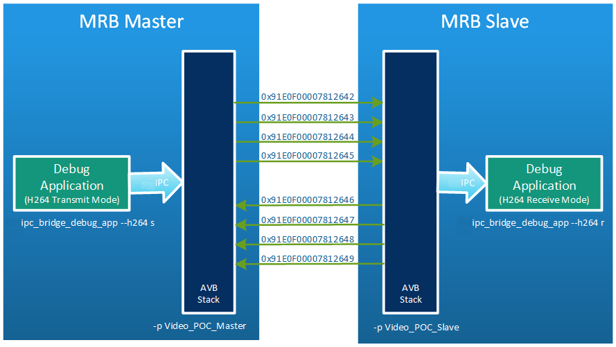
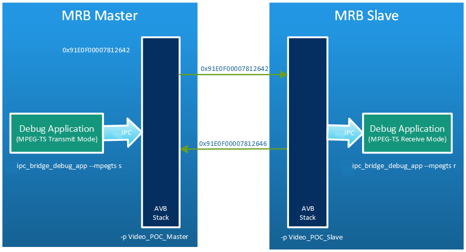

# Example Systems {#example_systems}

###############################################################
@page example_systems Example Systems
###############################################################

The following section describes some example system setups where the AVB stack is running on two MRBs back to back. Therefore special
configuration profiles have been created that allow the demonstration of audio and video streaming in different manner. 

###############################################################
@section audio_system_setup Audio System Setup

In this example the profiles @ref mrb_master_audio and @ref mrb_slave_audio of the configuration library are used to provide two stereo
and two multichannel audio streams going from MRB Master to MBR slave and the same amount of
streams vice versa. In addition to the audio streams the master sends out a media clock reference stream. This stream is
received by the slave device and is used to recover the media clock. By doing so a so called receive clock
 domain is created. From this clock domain the slave drives its outgoing transmit streams.

################################################
@subsection configuring_the_system Configuring The System

General information on how to setup the AVB stack can be found in section @ref system_adjustments.
The following only lists the steps that are necessary to setup the master and slave MRB for the audio example. 

* To use the configuration profiles @ref mrb_master_audio and @ref mrb_slave_audio edit the following file on both sides: 

      vi /etc/sysconfig/avb_streamhandler_demo

    On master side change the profile from

        -p MRB_Slave_Crs

    to

        -p MRB_Master_Audio
  

    On slave side change the profile from

        -p MRB_Slave_Crs

    to

        -p MRB_Slave_Audio

* If the network name does not match it can be easily adjusted within this file:

      /etc/sysconfig/avb

* To configure the PTP daemon the arguments passed in the command line of the PTP daemon running on master side need to be adjusted 
  in order to switch to PTP master role. Whereas on the slave side the parameter can be kept since they are already set for slave role.
  On the master side edit following file:

      /etc/sysconfig/gptp

    and change the arguments from

        -G ias_avb -R 250 -S

    to

        -G ias_avb -R 200

* AVB Stream Handler is not started on system start-up. It has to be started manually by using *systemd*. In the service file all
  dependencies to components like PTP daemon are listed so it is sufficient to start the Stream handler by the following command:

    systemctl start avb_streamhandler_demo

###############################################################
@subsection audio_playback_from_master_to_slave Audio Playback from Master to Slave

According to the figure above, four AVB Streams are configured from master to slave: 2 x stereo, 2 x 6-channel.
Details on the AVB and local stream definitions of the master MRB can be found in the profile @ref mrb_master_audio.
Details on the AVB and local stream definitions of the slave MRB can be found in the profile @ref mrb_slave_audio.

The master and slave MRB have the same streams configured but with transmit and receive directions swapped.

### Starting AVB Stream Handler

The AVB stack is not started automatically during system startup. Since the AVB stack is managed by *systemd*, there are two service files available:

* PTP daemon: gptp.service
* AVB streamhandler: avb_streamhandler\_demo.service

To start the AVB stack, type:
~~~~~~~~~~{.cpp}
systemctl start gptp
systemctl start avb_streamhandler_demo
~~~~~~~~~~
The _systemd_ commands _start_, _stop_ and _status_ are used to run, terminate or monitor the services, e.g.
~~~~~~~~~~{.cpp}
systemctl status gptp
systemctl status avb_streamhandler\_demo
~~~~~~~~~~
Check if both show on the command line as "active (running)".

The four AVB streams that are going from the master MRB unit to the slave MRB (stereo, multi-channel) are active by default.

After a successful start of the Stream Handler the following ALSA playback devices are available by using the _MRB\_Master\_Audio_ and _MRB\_Slave\_Audio_ profile:

* stereo_0
* stereo_1
* mc_0
* mc_1

These ALSA playback devices can be used for audio playback (streaming audio to the external amplifier) by using aplay.
For audio format conversion the *plug* plugin is used. The AVB device is declared in the ALSA configuration file located here:

    /usr/lib64/alsa-lib/50-smartx.conf 

Before calling _aplay_ the library path has to be set. This ensures that ALSA is able to find its plugins. This has to be done on both master
and slave side.

    export LD_LIBRARY_PATH=$LD_LIBRARY_PATH:/opt/audio/lib

Now _aplay_ can be used. On the master MRB type:

    aplay -Davb:stereo_0 <stereo.wav>
    aplay -Davb:stereo_1 <stereo.wav>
    aplay -Davb:mc_0 <6ch.wav>
    aplay -Davb:mc_1 <6ch.wav>

To test the ALSA sources provided in the slave MRB, _arecord_ can be used to capture the audio streams.

On the slave MRB type:

    arecord –vvv -Davb:stereo_0 -c 2 -r 48000 -f S16_LE /tmp/avb_stereo_0.wav
    arecord –vvv -Davb:stereo_1 -c 2 -r 48000 -f S16_LE /tmp/avb_stereo_1.wav

@note It's best practice to not use the serial console to call _aplay_ and _arecord_ especially not when using the verbose output (-vv).
Better establish an ssh session and call the applications from there. This is due to the high priority of the serial-to-USB driver which 
might cause problems by preempting the real-time threads.

###############################################################
@subsection smarxbar_audio_loopback_example SmartXbar / Audio Loop-Back Example

In this example audio is streamed from MRB master to slave MRB where it is routed back to the master MRB.
On the master side, the SmartXbar is used to route the audio from aplay's output to AVB.
It also receives the stream coming from the slave device and routes it to the local speakers.

To setup the system the following steps are needed:

* Connect the speakers to the output cable labled _Front-R_ and _Front-L_.

* If the MRBs didn't have valid IP addresses already, set them to e.g. 192.168.1.11 (master) and 192.168.1.12 (slave)  

* Start ssh sessions to both devices and set the environment variable for library path:

      export LD_LIBRARY_PATH=$LD_LIBRARY_PATH:/opt/audio/lib

* On the slave side, call the following in order to loop the stream back to the master:

      arecord -Davb:stereo_0 -v -c 2 -r 48000 -f S16_LE | aplay -Davb:stereo_0

* On the master side, call SmartXbar setup script and call _Interactive Example_ application:

      cd /opt/audio/gpmrb
      ./setupGpMrbAudio.sh
      cd /opt/audio/bin
      ./smartx_interactive_example

  From the user shell the following connections have to be established:

      # connect avb:stereo_0 to local speakers
      c 5 0
      # connect smartx:stereo0 to avb:stereo_0
      c 0 1

* Start playback of some wav file

      aplay -Dsmartx:stereo0 <stereo.wav> -vv

If everything works as expected, audio will play through the speakers.

###############################################################
@section video_system_setup Video System Setup

###############################################################
@subsection video_example1 Video Example 1 (H.264)
In this section, transmission of H.264 signals is demonstrated.

## Setup

Open an ssh shell and edit command line string for invocation of Stream Handler on both sides (master and slave MRB):

    vi /etc/sysconfig/avbstreamhandler

    // select profile '-p Video_POC_Master' on master side
    // and '-p Video_POC_Slave' on slave side

On the master side only, edit the command line of the PTP daemon to set it to master mode:

    vi /etc/sysconfig/gptp

    // change GPTP_PARAMS="-G ias_avb -R 250 -S" to GPTP_PARAMS="-G ias_avb -R 200"

On both sides, start the Stream Handler:

    systemctl start avbstreamhandler

## Start Streaming
        
On the master side, start debug application as sender:

    export LD_LIBRARY_PATH=/opt/ias/lib:/opt/audio/lib
    /opt/ias/bin/avb_video_debug_app -h -s

The following outpout should be seen:

    Avb Bridge Debug Application	1.0
    Using H.264 transport
    Create instance to send H.264 packets
    Send h264 packets - press ctrl-c to stop

    Sending..
    Packets sent -

On the slave side, start debug application as receiver

    export LD_LIBRARY_PATH=/opt/ias/lib:/opt/audio/lib
    /opt/ias/bin/avb_video_debug_app -h -r

If the transmission is successful the following messages should be seen:

        Avb Bridge Debug Application    1.0
        Using H.264 transport
        Create instance to receive H.264 packets

        H264_callback * Size 1400 Packet count 1
        RTP time stamp - 0xdeadbeef
        RTP sequence number - 0xe601
        Verifying data..

        *** Packet rate - 1

        Data Consistency check OK

        H264_callback * Size 1400 Packet count c9
        RTP time stamp - 0xdeadbeef
        RTP sequence number - 0xe6c9
        Verifying data..
        Data Consistency check OK

        H264_callback * Size 1400 Packet count 191
        RTP time stamp - 0xdeadbeef
        RTP sequence number - 0xe791
        Verifying data..
        Data Consistency check OK

        H264_callback * Size 1400 Packet count 259
        RTP time stamp - 0xdeadbeef
        RTP sequence number - 0xe859
        Verifying data..
        Data Consistency check OK

        H264_callback * Size 1400 Packet count 321
        RTP time stamp - 0xdeadbeef
        RTP sequence number - 0xe921
        Verifying data..
        Data Consistency check OK

    …

###############################################################
@subsection video_example2 Video Example 2 (MPEG-TS)
In this section transmission of MPEG-TS signals is demonstrated.

## Setup

Open an ssh shell and edit command line string for invocation of Stream Handler on both sides (master and slave MRB):

    vi /etc/sysconfig/avbstreamhandler

    // select profile '-p Video_POC_MpegTs_Master' on master side
    // and '-p Video_POC_MpegTs_Slave' on slave side

On the master side only, edit the command line of the PTP daemon to set it to master mode:

    vi /etc/sysconfig/gptp

    // change GPTP_PARAMS="-G ias_avb -R 250 -S" to GPTP_PARAMS="-G ias_avb -R 200"

On both sides, start the Stream Handler:

    systemctl start avbstreamhandler

## Start Streaming
        
On the master side, start debug application as sender:

    export LD_LIBRARY_PATH=/opt/ias/lib:/opt/audio/lib
    /opt/ias/bin/avb_video_debug_app -m -s

The following outpout should be seen:

    Avb Bridge Debug Application	1.0
    Using MPEG-TS transport
    Create instance to send MPEG-TS packets
    Send mpegts packets - press ctrl-c to stop

    Sending..
    Packets sent -
    Creating tsp - 0
    Creating tsp - 1
    Creating tsp - 2
    Creating tsp - 3
    Creating tsp - 4
    Creating tsp - 5
    Creating tsp - 6

      
On the slave side, start debug application as receiver:

    export LD_LIBRARY_PATH=/opt/ias/lib:/opt/audio/lib
    /opt/ias/bin/avb_video_debug_app -m -r

If the transmission is successful the following messages should be seen:

        Avb Bridge Debug Application    1.0
        Using MPEG-TS transport
        Create instance to receive MPEG-TS packets

        MpegTS_callback - PC 200 * ts packet received
        size 1352
        TS packets in packet 7

        *** Packet rate - 200

        SPH is set
        Verifying data..
        Data Consistency check OK

        MpegTS_callback - PC 400 * ts packet received
        size 1352
        TS packets in packet 7
        SPH is set
        Verifying data..
        Data Consistency check OK

        MpegTS_callback - PC 600 * ts packet received
        size 1352
        TS packets in packet 7
        SPH is set
        Verifying data..
        Data Consistency check OK

        MpegTS_callback - PC 800 * ts packet received
        size 1352
        TS packets in packet 7
        SPH is set
        Verifying data..
        Data Consistency check OK

        MpegTS_callback - PC 1000 * ts packet received
        size 1352
        TS packets in packet 7
        SPH is set
        Verifying data..
        Data Consistency check OK

    …

